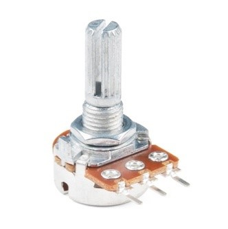

.. figure:: ../_static/Software_UI/Environment/Cover.jpg
    :align: center

Sensor Communication & Tuning
=============================

For the whale's movement in the game, three variables are acquired by the electronic system and sent in parallel at each time step. The variables are the two angles of rotation of the patient's legs that control the position and jaw of the whale, and a binary signal that controls the whale's water spray. Two potentiometers were used to detect the rotation of the patient's legs. 

The three lugs of the potentiometer correspond, from left to right, to power input, signal output and ground, as shown below:

Rotating the upper part of the potentiometer alters the resistance between the signal output and the power input as shown in the middle figure,

.. |potentiometer_lugs| image:: ../_static/Hardware_Sensor/potentiometer_lugs.png
    :align: top

+-------------------+-----------------------------+
| |potentiometer|   | |potentiometer_lugs|        | 
+-------------------+-----------------------------+

An Arduino M0 board is used to monitor the potentiometer's output as an analog reading in the range of `0` to `1023` from its serial ports A0 and A1, and digitise it.

.. |m0| image:: ../_static/Hardware_Sensor/m0.png
    :scale: 120%
    :align: top

+------+
| |m0| |
+------+

The potentiometer has a rotation range of `270` degrees, thus the potentiometer's output signal, `N`, can easily be converted into an angle, θ, in degrees using Equation:

.. math::
    \theta = \frac{270 \times N}{1023}

