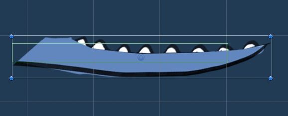
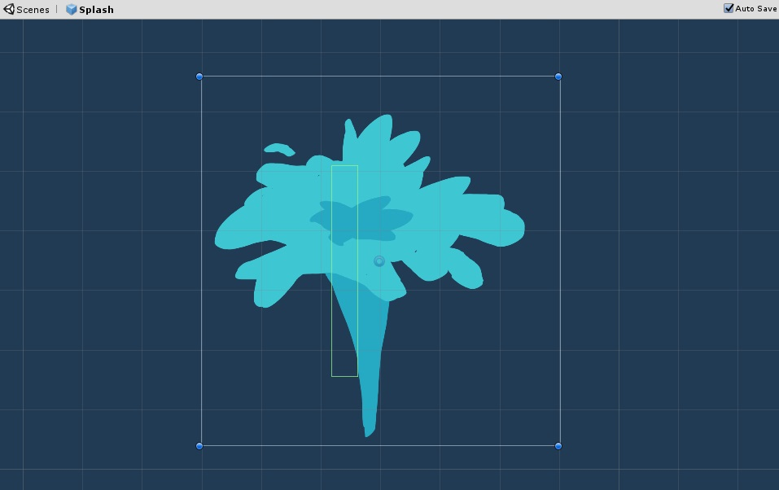

.. figure:: ../_static/Software_UI/Environment/Cover.jpg
    :align: center

**************
Player Control
**************

Jaw
---

For the convenience of development, the idle of the whale has been divided into two parts: 

* the body part (static animation which will not be interacting with any user input)
* the jaw part (which will rotate according to rheostat value)

.. |whale_body| image:: ../_static/Software_UI/Player/Whale_no_Jaw.jpg
   :scale: 40%
   :align: middle

+--------------+--------------+
| |whale_body| | |jaw|        |
+--------------+--------------+

Then, open the jaw to maximum of 60 degrees and map this to the maximum angle range the patient could open his leg (if the user chose Right leg mode of both leg mode, the system map the jaw open angle onto ``angle_r`` from Arduino Serial reading and vice versa):

.. code-block:: C#

    // Jaw.cs (... represents other code blocks irrelevant to the current session)

    ...

    [SerializeField] private bool isRightLeg;

    private float angleJaw; // whale jaw open angle controlled by leg open angle

    ...

    void Update () {
        ...
        
        if (isRightLeg) {
            angleJaw = arduinoHelper.angle_r / (calibrationMenu.angleRightConstraint / 60f);
        }
        else {
            angleJaw = arduinoHelper.angle_l / (calibrationMenu.angleRightConstraint / 60f);
        }

        PotentiometerControl(angleJaw);

        ...
    }

    ...

    // ----- Arduino Potentiometer Control -----

    void PotentiometerControl (float angle) {
        transform.localRotation = Quaternion.Euler(0, 0, -angle);
    }

Splash
------

The splash manipulation has been implemented in a way animations and box colliders of the splash object are pre-defined but hidden as default when the splash has not been triggered:

.. code-block:: C#

    // SplashManager.cs (... represents other code blocks irrelevant to the current session)

    ...

    void Start() {
        ...

        // initially disable the box collider, animator and sprite render and trigger later 
        box2D         = GetComponent<BoxCollider2D>();
        box2D.enabled = false;

        animator         = GetComponent<Animator>();
        animator.enabled = false;

        spriteRenderer         = GetComponent<SpriteRenderer>();
        spriteRenderer.enabled = false;

        // initially set the splash activatable to true
        isSplashActivatable = true;
    }
    
    ...

When the button connected to Arduino has been pressed, all 3 components above will be set to ``true`` and thus make usable basically by calling ``ActivateSplash()`` method:

.. code-block:: C#

    void ActivateSplash() {
        box2D.enabled          = true;
        animator.enabled       = true;
        spriteRenderer.enabled = true;
        Invoke("DeactivateSplash", splashDuration);
    }

