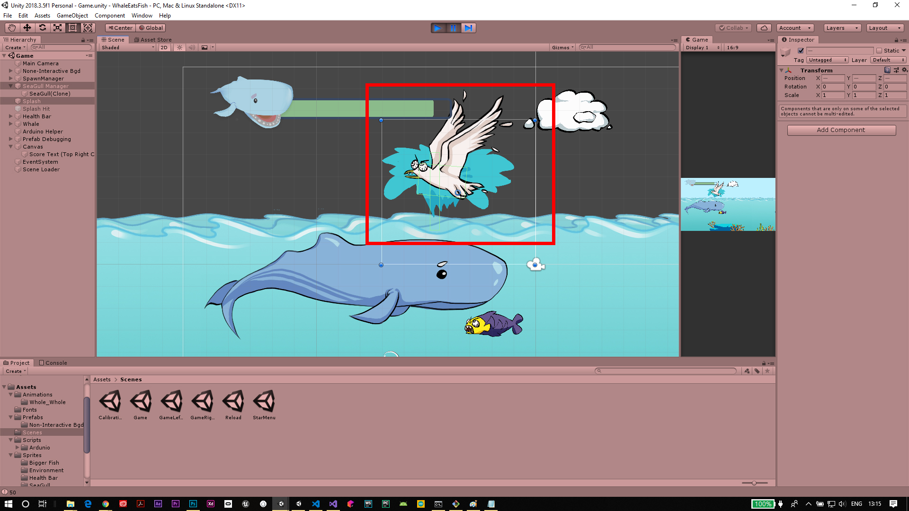

.. figure:: ../_static/Software_UI/Environment/Cover.jpg
    :align: center

*********************
Player Health & Score
*********************

Sprite Manipulations
--------------------

The Player Health has been shown using 3 layers of sprites:

* main sprite including Whale idle on the top
* an invisible mask on top of the bottom bar
* the bottom bar which represents the actual Health

.. image:: ../_static/Software_UI/Player_Health/Health_Bar.jpg
   :align: center

The manipulation of the appearance of the health bar pursued with a way that rather than vary the size of the green bar, the size of the mask on the green bar has been varied according to the current health.

To inplement this, the cached reference of the bar and the bar mask has been defined in prior:

.. code-block:: C#

    // PlayerHealth.cs (... represents other code blocks irrelevant to the current session)

    private Transform barMask;
    private Transform bar;

    ...

    void Awake() {
        barMask = transform.Find("Green Bar Mask");
        bar     = transform.Find("Green Bar");

        ...
    }

The manipulation of of the size has been implemented using the following function:

.. code-block:: C#

    // PlayerHealth.cs (... represents other code blocks irrelevant to the current session)

    private void SetSize(float sizeNormalised) {
        barMask.localScale = new Vector3(sizeNormalised, 1f);
    }

Health Point Manipulations
--------------------------

Firstly, in order to engage the patient to use their legs, the health point constant decreases and can only regenerate by eating fish:

.. code-block:: C#

    // PlayerHealth.cs (... represents other code blocks irrelevant to the current session)

    ...

    // ----- Health Manipulations -----

    private void ConstantHealthDecrease() {
        if (health > healthMin) {
            health -= healthDecreaseRate;
        }
    }

    // ----- Eaten Behaviour -----

    public void EatSmallFish() {
        health += 0.2f;
        ...
    }

    public void EatBigFish() {
        health += 0.4f;
        ...
    }

    ...

.. tip:: On the other hand, to prevent the patient from opening the mouth of the whale all the time, a penalty measure has been implemented which is the trash that deduct health points when being eaten:

.. code-block:: C#

    // PlayerHealth.cs (... represents other code blocks irrelevant to the current session)

    ...

    public void EatTrash() {
        health -= 0.6f;
    }

    ...

All three functions will be called when the ``Jaw`` collides with each of the corresponding objects. This will be further discussed in "Object Spawn & Their Properties" session.

The Sprites of the three spawned objects has shown below:

.. |big_fish| image:: ../_static/Software_UI/Spawn_Objects/bigFish_idol.png
   :align: middle

.. |small_fish| image:: ../_static/Software_UI/Spawn_Objects/smallFish_idol.png
   :align: top

+--------------+--------------+--------------+
| |big_fish|   | |small_fish| | |trash|      |
+--------------+--------------+--------------+

There are two constraints on the health points of the player:

* the maximum health point (which is the HP when the player is fully healthy)
* the minimum health where the player die

Since the health calculation has been normalise, the max and min are just 0 and 1:

.. code-block:: C#

    // PlayerHealth.cs (... represents other code blocks irrelevant to the current session)

    ...

    [SerializeField] private float healthMax = 1f;
    [SerializeField] private float healthMin = 0f;

    ...

When the health point are higher than the maximum by gaining points from the fish, it will be set back to the maximum. When it's lower than the minimum, the program will directly load the death scene which is the replay scene:

.. code-block:: C#

    // PlayerHealth.cs (... represents other code blocks irrelevant to the current session)

    ...

    void Update() {
        ...

        ConstantHealthDecrease();
        SetSize(health);

        if (health > healthMax) {
            health = healthMax;
        } else if (health <= healthMin) {
            // player dead, load game over scene to reload
            sceneLoader.LoadReloadScene();
        }
    }

    ...

.. figure:: ../_static/Software_UI/Scenes/Reload_Scene.jpg
    :align: center
    :figclass: align-center

    Reload Scene

Score
-----

Apart from health point which is the essential factor for the player to be alive, score is another factor the player will be chasing upon.

The appearance of the score uses TextMeshPro UI in the Canvas object:

.. figure:: ../_static/Software_UI/Scenes/Score_Editor.jpg
    :align: center
    :figclass: align-center

    Score TextMeshPro in Editor

Then we manipulate it by updating ``scoreText.text`` in the script:

.. code-block:: C#

    private int score;
    [SerializeField] private TextMeshProUGUI scoreText;

    ...

    void Update() {
        scoreText.text = score.ToString();

        ...
    }

Eating fish and splash the seagull both have effect on the scoring:

.. code-block:: C#

    ...

    // ----- Eaten Behaviour -----

    public void EatSmallFish() {
        ...
        score += 20;
    }

    public void EatBigFish() {
        ...
        score += 40;
    }

    ...

    // ----- Splash SeaGull -----

    public void SplashSeaGull() {
        score += 60;
    }

The last one will be triggered when a seagull collide with the ``Splash`` box collider (which will be further discussed in Object Spawn Section):

    SeaGull & Splash Box Collider Interaction Scene in Editor