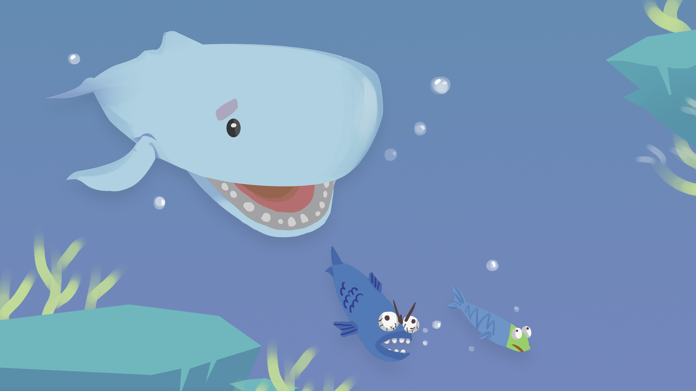

*********************
Player Health & Score
*********************

Sprite Manipulations
--------------------

The Player Health has been shown using 3 layers of sprites:

* main sprite including Whale idle on the top
* an invisible mask on top of the bottom bar
* the bottom bar which represents the actual Health

The manipulation of the appearance of the health bar pursued with a way that rather than vary the size of the green bar, the size of the mask on the green bar has been varied according to the current health.

To inplement this, the cached reference of the bar and the bar mask has been defined in prior:

.. code-block:: C#

    // PlayerHealth.cs (... represents other code blocks irrelevant to the current session)

    private Transform barMask;
    private Transform bar;

    ...

    void Awake() {
        barMask = transform.Find("Green Bar Mask");
        bar     = transform.Find("Green Bar");

        ...
    }

The manipulation of of the size has been implemented using the following function:

.. code-block:: C#

    // PlayerHealth.cs (... represents other code blocks irrelevant to the current session)

    private void SetSize(float sizeNormalised) {
        barMask.localScale = new Vector3(sizeNormalised, 1f);
    }

Health Point Manipulations
--------------------------

Firstly, in order to engage the patient to use their legs, the health point constant decreases and can only regenerate by eating fish:

.. code-block:: C#

    // PlayerHealth.cs (... represents other code blocks irrelevant to the current session)

    ...

    // ----- Health Manipulations -----

    private void ConstantHealthDecrease() {
        if (health > healthMin) {
            health -= healthDecreaseRate;
        }
    }

    // ----- Eaten Behaviour -----

    public void EatSmallFish() {
        health += 0.2f;
        ...
    }

    public void EatBigFish() {
        health += 0.4f;
        ...
    }

    ...

.. tip:: On the other hand, to prevent the patient from opening the mouth of the whale all the time, a penalty measure has been implemented which is the trash that deduct health points when being eaten:

.. code-block:: C#

    // PlayerHealth.cs (... represents other code blocks irrelevant to the current session)

    ...

    public void EatTrash() {
        health -= 0.6f;
    }

    ...

All three functions will be called when the ``Jaw`` collides with each of the corresponding objects. This will be further discussed in "Object Spawn & Their Properties" session.

The Sprites of the three spawned objects has shown below:

.. |big_fish| image:: ../_static/Software_UI/Spawn_Objects/bigFish_idol.png
   :align: middle

.. |small_fish| image:: ../_static/Software_UI/Spawn_Objects/smallFish_idol.png
   :align: top

.. |trash| image:: ../_static/Software_UI/Spawn_Objects/Can.png
   :align: top

+--------------+--------------+--------------+
| |big_fish|   | |small_fish| | |trash|      |
+--------------+--------------+--------------+

Score
-----