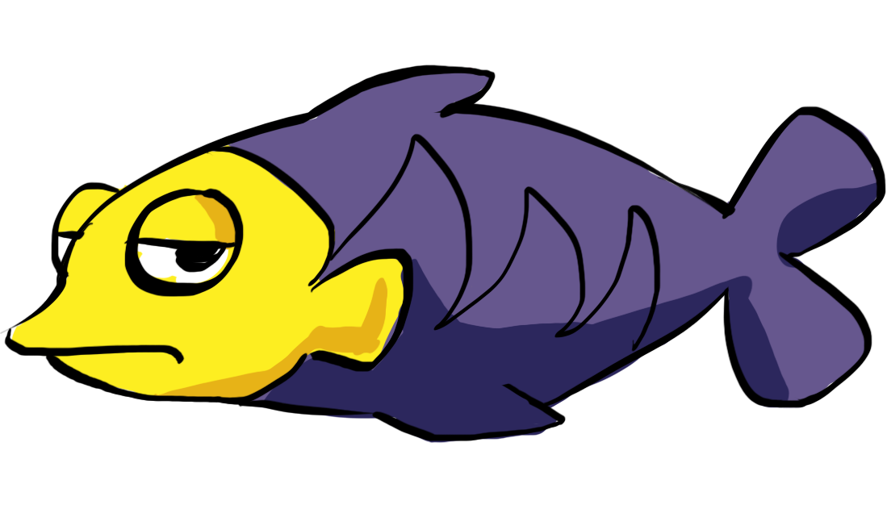
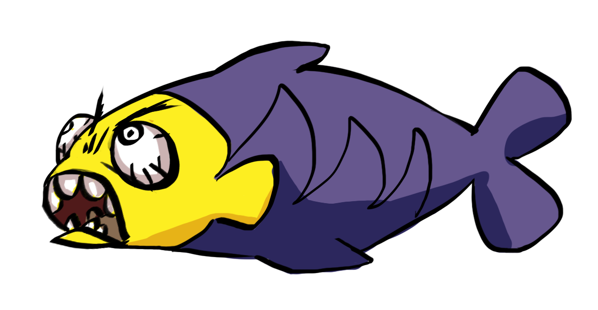
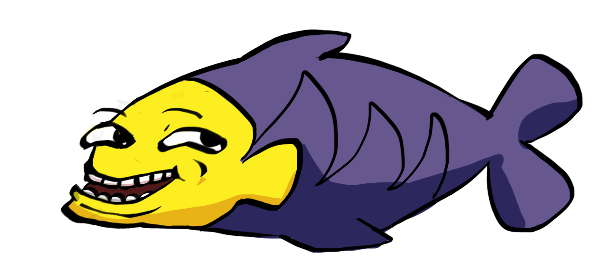
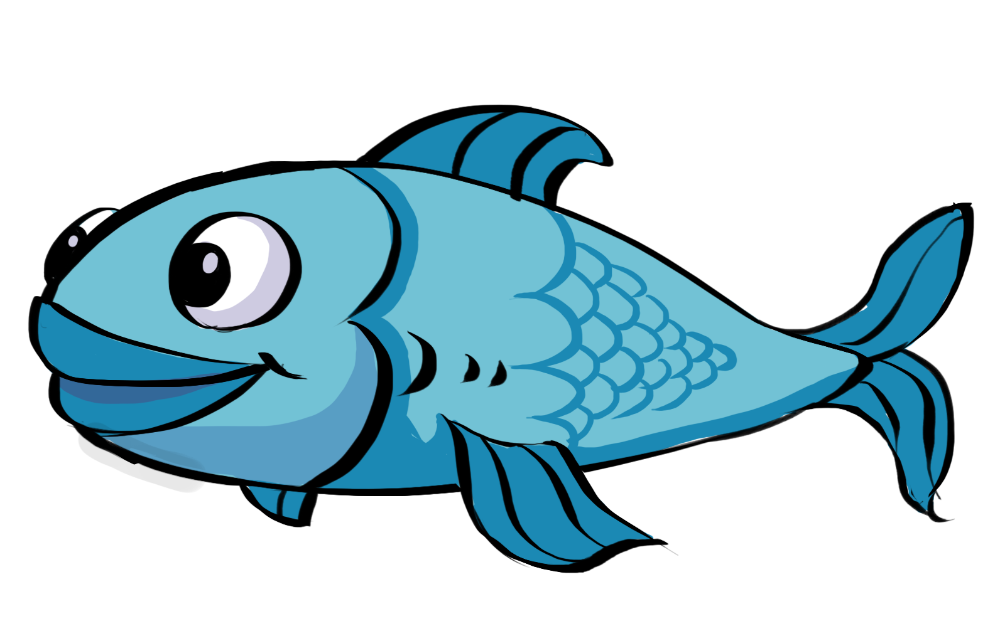
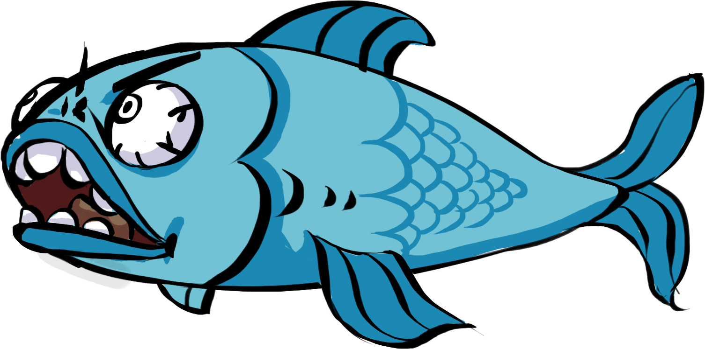
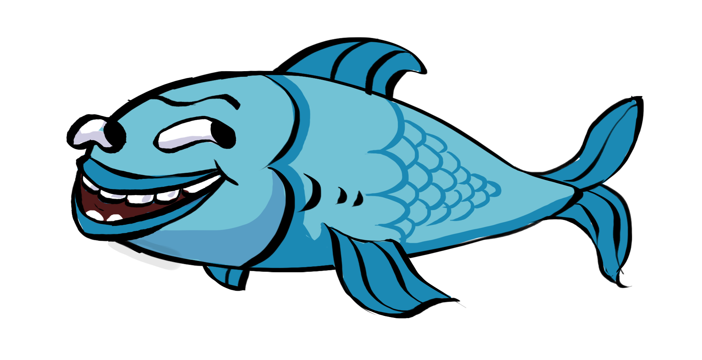
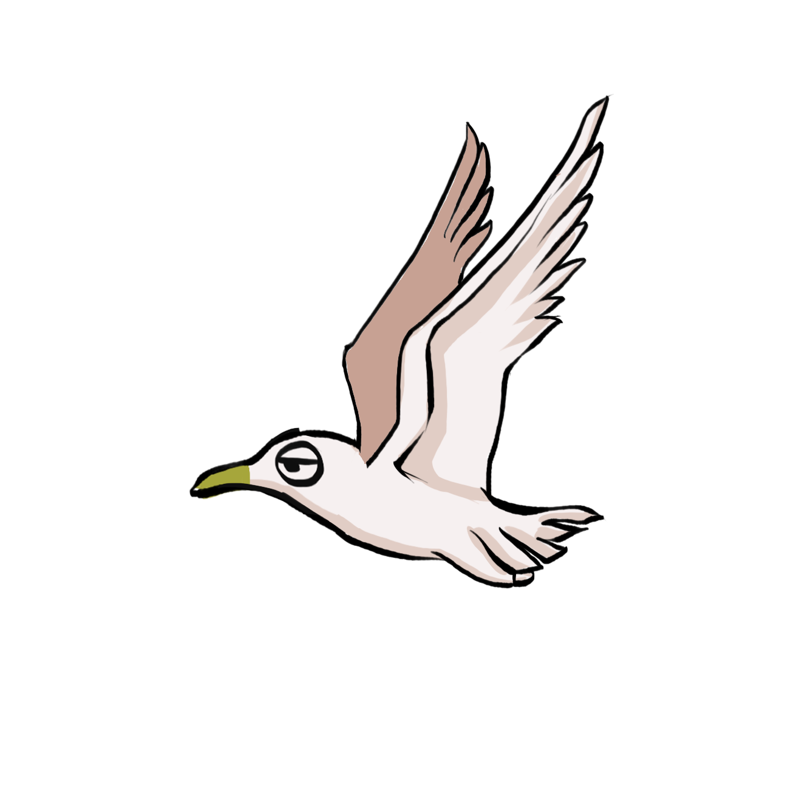
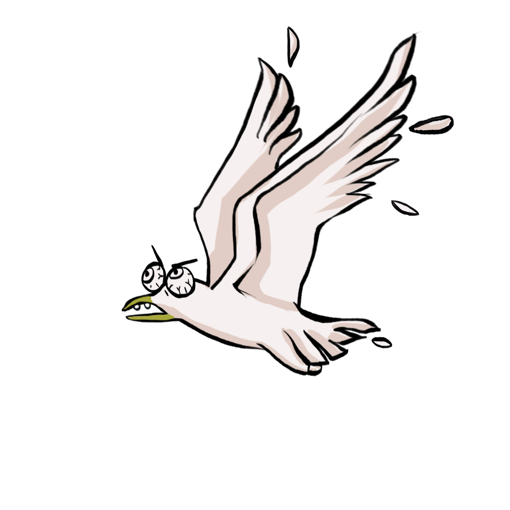

.. figure:: ../_static/Software_UI/Environment/Cover.jpg
    :align: center

Objects Spawn & Properties
==========================

Objects Spawn
-------------

The object spawn action has been conducted in two scripts in parallel:

* ``SpawnManager.cs`` (which takes charge of all items spawn in the sea)
* ``SpawnSeaGullManager.cs`` (which only takes charge of spawning seagull)

The two classes have no interactions and effect on each other and working simulataniously.

Spawning Sea Objects
~~~~~~~~~~~~~~~~~~~~

The spawn of the sea objects starts since 2s after the beginning of the game, every 2s, a new object will be spawned:

.. code-block:: C#

    void Start() {
        // trigger spawning new object, starting from 2s, with frequency of once each 2s
        InvokeRepeating("spawnObject", 2.0f, spawnInterval);
    }

In the ``SpawnObject()`` function, two random values have been generated first to determine which object to spawn and which altitute to spawn that:

.. code-block:: C#

    // SpawnManager.cs (... represents other code blocks irrelevant to the current session)

    private void SpawnObject() {
        ...

        // random 1/3 possibility spawning each of the 3 plausible objects
        // random 1/2 possibility spawning at each of the 2 plausible altitude
        Random random = new Random();
        int randomThresholdObject = random.Next(1, 4); // generate a integer number between 1, 2, 3
        int randomThresholdPos    = random.Next(1, 3); // generate a integer number between 1, 2

        ...
    }

Then an ``if-else`` statement will firstly determine which object to spawn under the constraint of play mode:

* Under Only "Right Leg" or "Left Leg" play mode: the object will only be spawn in the higher altitude.
* Under "Both Leg" mode, the object will be spawned via two lanes each of 50% chance.

.. code-block:: C#

    // SpawnManager.cs (... represents other code blocks irrelevant to the current session)

    [SerializeField] private bool isBothLegMode;

    ...

    private void SpawnObject() {
        ...

        // determine the altitude of the object spawn position, assigning values to spawnPos
        if (isBothLegMode) {
            if (randomThresholdPos == 1) {
                spawnPos = spawnPosHigher;
            } else if (randomThresholdPos == 2) {
                spawnPos = spawnPosLower;
            }
        } else {
            spawnPos = spawnPosHigher;
        }

        ...
    }

Lastly, an "if-else" statement has been implemented to determine which object being spawned according to the sprite defined as configuration parameters above:

.. code-block:: C#

    // SpawnManager.cs (... represents other code blocks irrelevant to the current session)

    [SerializeField] private GameObject smallFish;
    [SerializeField] private GameObject bigFish;
    [SerializeField] private GameObject trash;

    ...

    private void SpawnObject() {
        ...

        // determine which object will be spawned at the previous defined altitude
        if (randomThresholdObject == 1) {
            newSpawn = Instantiate(
                smallFish,
                spawnPos,
                Quaternion.identity);
            ...
        } else if (randomThresholdObject == 2) {
            newSpawn = Instantiate(
                bigFish,
                spawnPos,
                Quaternion.identity);
            ...
        } else if (randomThresholdObject == 3) {
            newSpawn = Instantiate(
                trash,
                spawnPos,
                Quaternion.Euler(0, 0, -20f)); // beware the trash spawn has rotation angle
            ...
        }
    }

Spawning SeaGull
~~~~~~~~~~~~~~~~

SeaGull spawn on the other hand, is much simpler since there is only one spawn altitude and one plausible object being spawned:

.. code-block:: C#

    // SpawnSeaGullManager.cs (... represents other code blocks irrelevant to the current session)

    void Start() {
        // trigger spawning new object, starting from 2s, with frequency of once each 2s
        InvokeRepeating("SpawnSeaGull", 2.0f, spawnSeaGullInterval);

        seaGull = seaGullGameObject.GetComponent<SeaGull>();
    }

    ...

    // sea gull is not part of the fish-trash system and the spawning rate is very low
    // thus doesn't need to be wrapped into the above object spawn-destroy system
    void SpawnSeaGull() {
        GameObject newSpawnSeaGull;

        newSpawnSeaGull = Instantiate(
            seaGullGameObject,
            spawnPosSeaGull,
            Quaternion.identity);
        newSpawnSeaGull.transform.parent = transform;
    }

Constant Leftward Movement
~~~~~~~~~~~~~~~~~~~~~~~~~~

The constant leftward movement of the sea objects pursue with the following logic:

1. when a new object has been spawned, append it to the current spawn manager parent object
2. in each iteration of ``Update()`` function being called, loop through all the current children of the parent spawn manager object in a for-loop 
3. apply a left-ward vector to every single child in the loop

.. note:: since the child objects of spawn manager could be distroyed due being eaten by the Whale or self-destructed outside the boundary of the screen, the number of items within the spawn manager is varying thus need a agile and flexible approach on a dynamic array instance of collection of all children objects.

.. code-block:: C#

    // SpawnSeaGullManager.cs (... represents other code blocks irrelevant to the current session)

    ...

    void Update() {
        float displacement = Time.deltaTime * speed;

        // store all children under Spawn Manager in an array
        Transform[] children = transform.Cast<Transform>().ToArray();

        for (int i = 0; i < children.Length; i++) {
            var child = children[i];
            // beware to add Space.World or otherwise default will be Space.Self
            // where rotation angle of the object will be stored as well
            child.transform.Translate(Vector2.right * displacement, Space.World);
        }
    }

The append of child happend during the creation of each object:

.. code-block:: C#

    // SpawnSeaGullManager.cs (... represents other code blocks irrelevant to the current session)

    private void SpawnObject() {
        // instantiate the next spawn
        GameObject newSpawn;

        ...

        // determine which object will be spawned at the previous defined altitude
        if (randomThresholdObject == 1) {
            newSpawn = Instantiate(
                smallFish,
                spawnPos,
                Quaternion.identity);
            addChildToCurrentObject(newSpawn);
        } else if (randomThresholdObject == 2) {
            newSpawn = Instantiate(
                bigFish,
                spawnPos,
                Quaternion.identity);
            addChildToCurrentObject(newSpawn);
        } else if (randomThresholdObject == 3) {
            newSpawn = Instantiate(
                trash,
                spawnPos,
                Quaternion.Euler(0, 0, -20f)); // beware the trash spawn has rotation angle
            addChildToCurrentObject(newSpawn);
        }
    }

    void addChildToCurrentObject(GameObject item) {
        // make the current item a child of the SpawnManager
        item.transform.parent = transform;
    }

Destroy Objects
~~~~~~~~~~~~~~~

If the object spawned hasn't been eaten, it will continue to move left-wards and stack in the spawn manager parent object, which will consume plenty of computer memory and thus harmful for the program.

Therefore, all object will be destroyed if they are outside the left boundary of the screen to save the computational power.

.. code-block:: C#

    // DestroyObject.cs (... represents other code blocks irrelevant to the current session)

    [SerializeField] private float destroyXPos = -18f;

    ...

    void Update() {
        DestroyHierarchy();
    }

    public void DestroyHierarchy() {
        //Debug.Log(gameObject.transform.position.x);
        if (gameObject.transform.position.x < destroyXPos) {
            Destroy(gameObject);
        }
    }

Object Properties
-----------------

Properties of Objects in the Sea
~~~~~~~~~~~~~~~~~~~~~~~~~~~~~~~~

**Collision Trigger**

Following the last section, the health point manipulations has been triggered in each of the object's class. The triggering ultilise ``OnTriggerEnter2D()`` function rather than ``OnCollisionEnter2D()`` because we want the object to pass through and trigger the event rather than collide and bounce away. Using small fish as an example:

.. code-block:: C#

    // SmallFish.cs (... represents other code blocks irrelevant to the current session)

    private void OnTriggerEnter2D(Collider2D collision) {
        playerHealth.EatSmallFish();
    }

**Sprite Transition**

In order to increase the repetibility of the game by adding more fun factors into the UI design, sprite transitions has been implemented to the two kinds of fishes:

* When the fish the far from the whale, it shows a normal fish
* When the fish is close to the whale but not passed yet, the fish shows a frigtened face inspired by rage faces from memes
* When the whale miss eating a fish, the fish shows a grin face

+--------------------+--------------------+--------------------+
| Normal             | Frigtened          | Grin               |    
+--------------------+--------------------+--------------------+
| |sfish_idol|       | |sfish_frightened| | |sfish_smile|      |
+--------------------+--------------------+--------------------+

+--------------------+--------------------+--------------------+
| Normal             | Frigtened          | Grin               |   
+--------------------+--------------------+--------------------+
| |bfish_idol|       | |bfish_frightened| | |bfish_smile|      |
+--------------------+--------------------+--------------------+

The implementation involves basically getting the component of the sprite renderer and change the correponding sprite which has been pre-defined in the ``[SerializeField]``. The following example uses smalle fish as an example:

.. code-block:: C#

    // SmallFish.cs (... represents other code blocks irrelevant to the current session)

    // ------------------------------------------------------
    // Config Params
    // ------------------------------------------------------

    [SerializeField] private Sprite smallFishDefault;
    [SerializeField] private Sprite smallFishFrightened;
    [SerializeField] private Sprite smallFishLaugh;

    ...

    private void ChangeSprites() {
        if (transform.position.x > -7f &&
            transform.position.x < 4f) {
            // When the fish is close to the jaw but not being eaten yet
            GetComponent<SpriteRenderer>().sprite = smallFishFrightened;
        } else if (transform.position.x < -7f) {
            // When the fish passed the Whale, indicating the Whale missed capturing it
            GetComponent<SpriteRenderer>().sprite = smallFishLaugh;
        }
    }

Properties of the SeaGull
~~~~~~~~~~~~~~~~~~~~~~~~~

The movement of the SeaGull is more complicated than the previous fishes since it involves the a dropping mechanism. This has been implemented using the manipulations of ``rigidbody`` type of the object. 

* When a seagull has been spawned, the rigidbody type has been set to ``kinematic`` where there is no effect of gravity onto the object. 
* When the seagull hit with the splash box collider, change the rigidbody type to ``dynamic`` where gravity has an effect on the object and therefore it falls into the water.

.. code-block:: C#

    // SeaGull.cs (... represents other code blocks irrelevant to the current session)

    private Rigidbody2D rigidbody2D;

    void Start() {
        rigidbody2D = GetComponent<Rigidbody2D>();
        ...
    }

    ...

    private void ChangeRigidBodyType() {
        // change to rigidbody type to dynamics thus could use gravity
        rigidbody2D.bodyType = RigidbodyType2D.Dynamic;
    }

When it falls into water, ignore the gravity again and apply a horizontal left-wards vector onto it for it to flow.

.. code-block:: C#

    // SeaGull.cs (... represents other code blocks irrelevant to the current session)

    // get rid off all downwards force and make the object slowly move with water towards left
    private void FlowWithWater() {
        if (transform.position.y < 0.5f) {
            rigidbody2D.gravityScale = 0;
            rigidbody2D.velocity = new Vector3(-1.5f, 0, 0);
        }
    }

The Sprite also changed from the normal one to a frightened one:

+----------------------+----------------------+
| Normal               | Frigtened            |
+----------------------+----------------------+
| |seagull_normal|     | |seagull_frightened| |
+----------------------+----------------------+

.. code-block:: C#

    private void ChangeAnimation() {
        animator.SetBool("IsHitByFlush", true);
    }