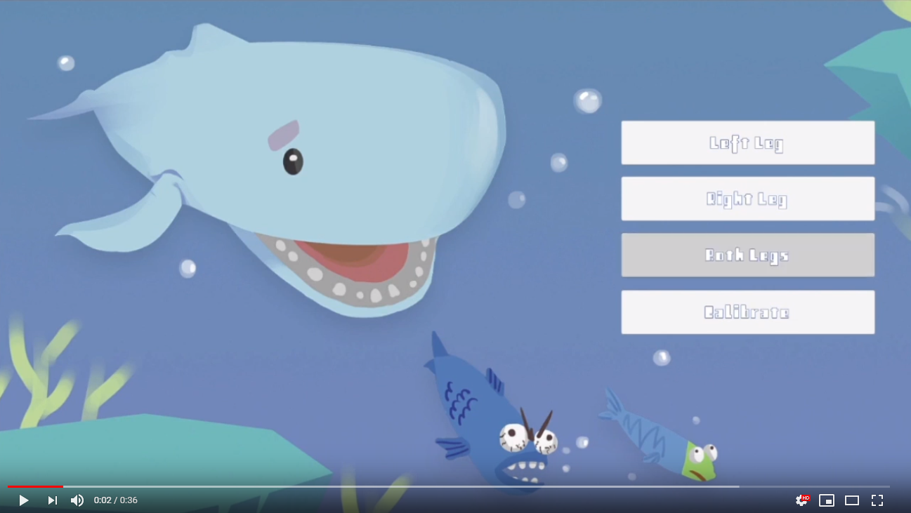

<h1 align="center">
  
   
   
  Open-Sesame Project
</h1>

<h4 align="center">
  <a href="https://open-sesame-docs.readthedocs.io">
    View the Project Documentation online
  </a>
   
   
  <a href="./BE_HCARD_OPEN-SESAME.pdf">
    View the Report in PDF format
  </a>
   
   
  
</h4>

  Design Engineering, Imperial College London

 

  
</h1>